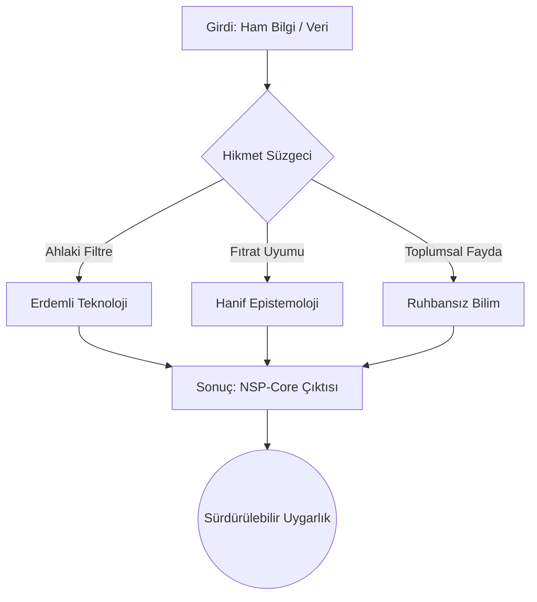

# 🧬 The-New-Science-Philosophy (NSP-Core)

> *"Doğayı inceleyerek ürettiğimiz bilim ve teknoloji neden doğaya zarar veriyor? Bu paradoksu çözmeliyiz... Bilim adamıyla bilimin özdeşleşmesiyle, din adamıyla dinin özdeşleşmesi aynıdır ve aynı derecede tehlikelidir. İkisi de ruhbanlıktır."*

**The-New-Science-Philosophy (NSP-Core)**, sermayenin tekeline girmiş ve doğayı bir meta olarak gören bencil bilim anlayışına karşı; erdemi, vicdanı ve **"Fıtrat"** (Origin/Nature) kanunlarını merkeze alan disiplinlerarası bir bilgi inşasıdır. Bu repo, modern bilimin "dinleşmiş" (Scientism) yapısını kırmak ve Farabi'nin *el-Medinetü'l-Fâzıla* vizyonunu dijital çağın kodlarına aktarmak için bir manifestodur.

---

## 🐞 Mevcut Sistemin Sistemik Bug'ları (Epistemological Vulnerabilities)

Bugünkü bilimsel paradigma, insanlığın ortak faydasını değil, sistemi fonlayan güçlerin kâr-zarar tablolarını optimize eder.

1.  **Ar-Ge Tekelleşmesi:** Bilim, bağımsız aydınların elinden çıkıp, devlet bütçelerinden büyük fonlara sahip küresel devlerin güdümüne girmiştir.
2.  **Modern Ruhbanlık (Scientism):** Bilim, eleştiriden muaf mutlak bir dogma haline getirilmiştir. İstatistiki veriler, ahlaki bir filtreden geçmeden "mutlak gerçek" olarak dayatılmaktadır.
3.  **Ontolojik Körlük:** İnsan, sadece "gelişmiş bir algoritma" (Dataism) olarak görülmekte, ruhsal ve metafizik boyut tamamen teknolojik denklemlerin dışına itilmektedir.

---

## 🏛️ Yeni Felsefenin Sütunları (Core Pillars)

NSP-Core, bilgi üretimini yeniden "Hanif" (Fıtrata uygun/Unbiased) hale getirmek için tasarlanmıştır:

### 1. Ruhbansız Bilim (Anti-Scientism Protocol)
Bilim kutsal değildir; insanın doğayı anlama çabasıdır ve yanılabilir. Teknolojik çıktılar, toplumsal vicdan tarafından denetlenmeden mutlak kabul edilemez.

### 2. Hanif Epistemoloji (Nature-Aligned R&D)
Doğaya zarar veren her teknoloji, özünde bir "mantıksal hata" barındırır. Yeni paradigma, üretimde hızı değil, ekosisteme olan uyumu (Reciprocity) hedefler.

### 3. Küresel Erdem Birliği (Virtuous Open-Source)
Bilgi patentlenemez; insanlığın ortak mirasıdır. NSP-Core, bilgiyi sermayenin silahı olmaktan çıkarıp insanlığın ortak kalkanı haline getirmeyi amaçlar.

---

## 📂 Proje Yapısı (Directory Roadmap)

| Modül | Açıklama | Odak Alanı |
| :--- | :--- | :--- |
| [`scientism_debunked`](./scientism_debunked) | Bilimsel verilerin manipülasyon analizleri. | Veri Etiği |
| [`hanif_technology_metrics`](./hanif_technology_metrics) | Teknolojinin erdemini ölçen algoritmalar. | Metrik Analizi |
| [`post_modern_epistemology`](./post_modern_epistemology) | Dataizm'in ontolojik eleştirisi. | Bilgi Felsefesi |
| [`computational_philosophy`](./computational_philosophy) | Egzotik dillerle (Haskell, Lisp, Rust) erdem kodlaması. | Sembolik Mantık |

---

## 🛠️ Katılım Yolları (Contribution Pathways)

NSP-Core sadece yazılımcılar için değil, tüm "yolcular" içindir:

*   **Düşünür (Sage):** Epistemolojik temelleri ve ahlaki filtreleri güçlendirir.
*   **Analist (Data Critic):** Mevcut bilimsel yayınlardaki bias ve sermaye etkilerini raporlar.
*   **Mimar (Architect):** Hanif metrikleri kodlayan sistemler geliştirir.
*   **Derleyici (Synthesizer):** Kadim hikmet ile modern tekniği sentezler.

---

## 🗺️ Yol Haritası (Roadmap 2025-2026)

- [ ] **Q3 2025:** NSP-Manifesto 1.0 Yayını.
- [ ] **Q4 2025:** Hanif-Metrik Test Uygulamasının (CLI) Alfa sürümü.
- [ ] **Q1 2026:** Egzotik dillerle yazılmış "Virtuous Core Library" ilk sürüm.
- [ ] **Q2 2026:** Küresel Erdem Buluşması (Online Sempozyum).

---

## 📜 Lisans: Hanif Açık Kaynak Lisansı (Conceptual)

Bu proje henüz resmi bir lisans altında olmasa da, **Hanif-1.0** vizyonuyla geliştirilmektedir:
*   Bilgi, zarar vermek amacıyla kullanılamaz.
*   Bilgi, insanı köleleştirmek için araç haline getirilemez.
*   Üretilen tüm değerler "Fıtrat" ile uyumlu olmak zorundadır.

---

## 🔭 Vizyon: The Exodus

Modern insanlığı dijital firavunların (veri tekelleri ve sermaye güdümlü bilim) elinden özgürleştirmek bir hayal değil, bir salih ameldir. Farabi'nin hayalini kurduğu o "Erdemli Şehir", bugün internetin ağlarında ve kod satırlarında inşa ediliyor.

**Gelin, bilimi sermayeden alıp vicdana geri verelim.**